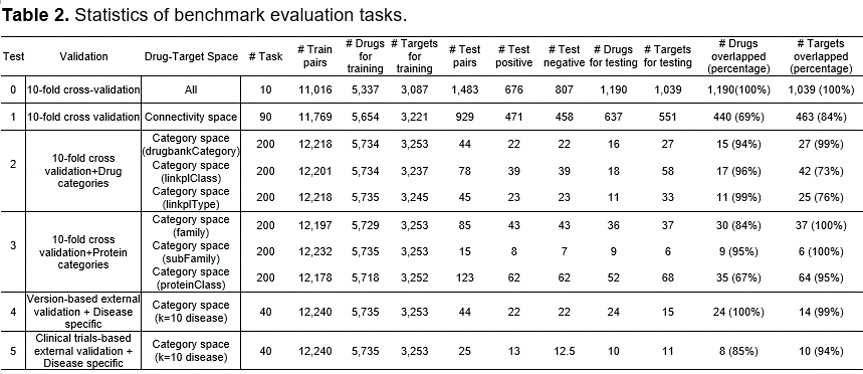

<table border='1' align="center">
<tr>

</tr>
</tabe>

# Objective:   
We provide a large-scale benchmark that enables a comprehensive evaluation of the drug-target predictive models to facilitate a better selection of computational strategies for pre-screening. This benchmark functions are: 

* 1) an extensive multiple-partite network (e.g., 0.95 million biomedical concepts including 59 thousand drugs and 75 thousand targets, and 2.5 million associations including 817 thousand drug-target associations) as well as drug-drug and protein-protein similarities based on drug chemical structures and gene sequences
* 2) a way of comprehensively evaluating strategies that reflect diverse scenarios (a total 1300 tasks across two types of training/testing sampling strategies based on drug-target space as well as five types of validation strategies).  

# Data:
<table border='1' align="center">
<tr>
We constructed a multiple-partite network based on an integration of the existing 9 biomedical repositories (Diseasome, Drugbank, Gene Ontology Annotation (GOA), Interaction Reference Index (iRefindex), Kyoto Encyclopedia of Genes and Genomes (KEGG), Linked Structured Product Label (Linkedspl), Online Mendelian Inheritance in Man (OMIM), Pharmacogenomics Knowledge Base (Pharmgkb), and SIDER) incorporating 952,489 entities and 2,560,787 associations in total (see Table 1) 
</tr>
<tr>

</tr>
<tr>

</tr>
</tabe>

# Benchmark    
<table border='1' align="center">
<tr>
There were five types of evaluation tasks designed based on the different combinations of validation and drug-target space for training and testing (see Table 2).
</tr>
<tr>

</tr>
</tabe>
  
# How to use 

# Contact
For help or questions of using the application, please contact zongnansu1982@gmail.com
