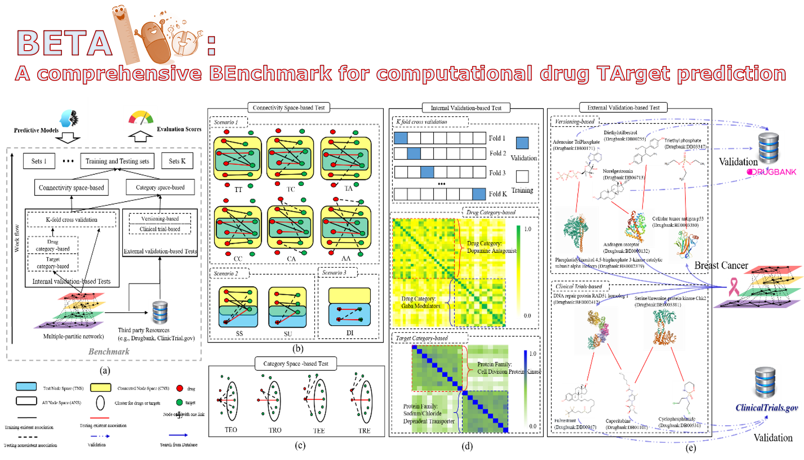
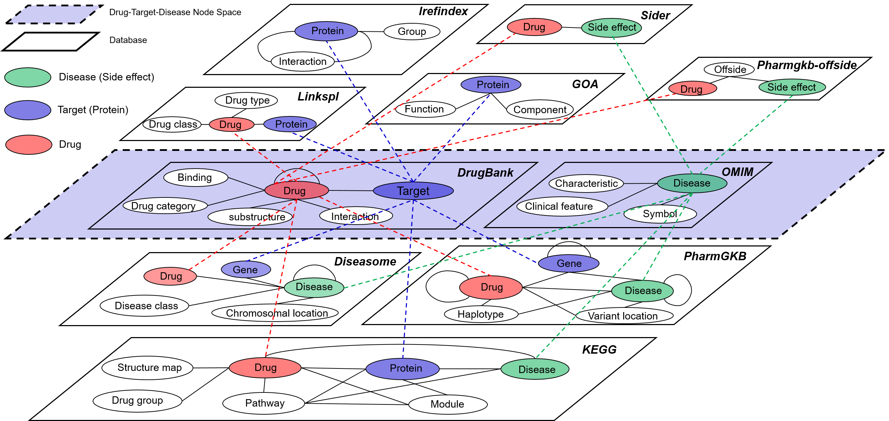
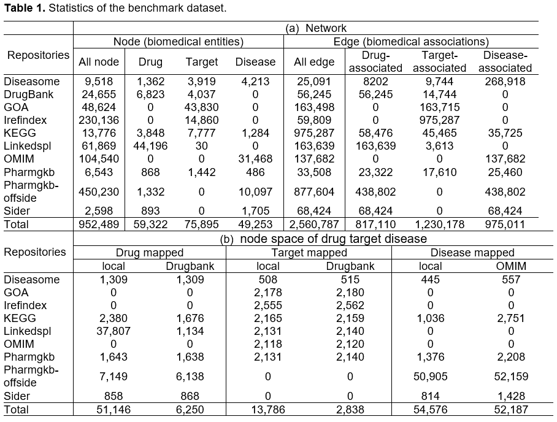

<table border='1' align="center">
<tr>

</tr>
</tabe>

# Objective:   
We provide a large-scale benchmark that enables a comprehensive evaluation of the drug-target predictive models to facilitate a better selection of computational strategies for pre-screening. This benchmark functions are: 

* 1) an extensive multiple-partite network (e.g., 0.95 million biomedical concepts including 59 thousand drugs and 75 thousand targets, and 2.5 million associations including 817 thousand drug-target associations) as well as drug-drug and protein-protein similarities based on drug chemical structures and gene sequences
* 2) a way of comprehensively evaluating strategies that reflect diverse scenarios (a total 1300 tasks across two types of training/testing sampling strategies based on drug-target space as well as five types of validation strategies).  

# Data:
<table border='1' align="center">
<tr>

</tr>
<tr>

</tr>
</tabe>

# Usage   
* Embedding
	* (a) node2vec
		* 1. covert input data to node2vec format data: PythonDataPreparement.java
		* 2. generate Python script for node2vec embedding: PythonScripter.java
		* 3. node2vec embedding: https://github.com/aditya-grover/node2vec
		* 4. post-process for the embedding model: EmbeddingPostProcessing.java
	* (b) deepwalk
		* 1.deepwalk-based embedding: DeepWalkMethod().training(parameters)
* Prediction   
  

# Contact
For help or questions of using the application, please contact zongnansu1982@gmail.com
